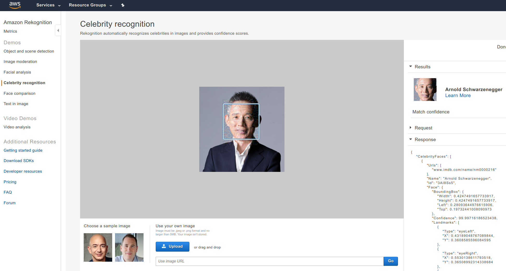
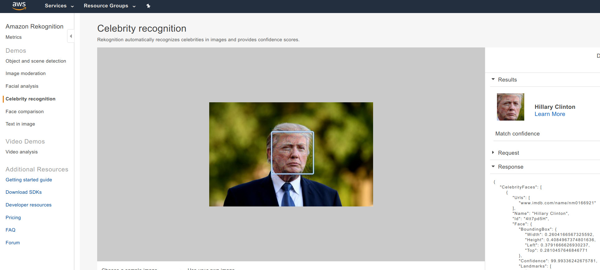
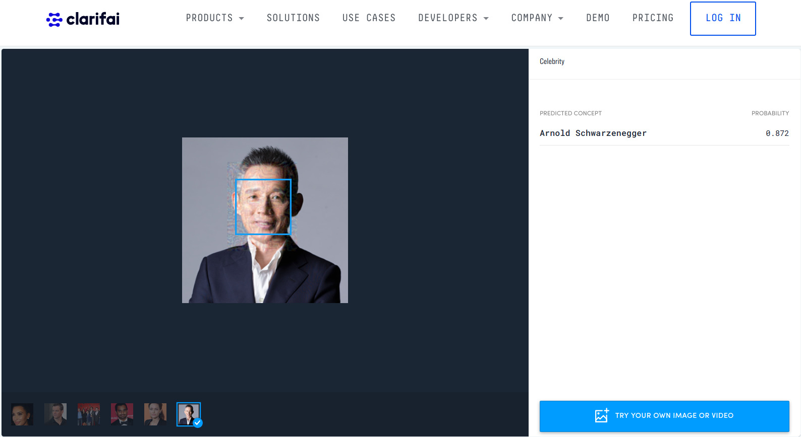

## Black-Box Adversarial Attack on Public Face Recognition Systems

[Geekpwn CAAD](https://en.caad.geekpwn.org/) (Competition on Adversarial Attacks and Defenses) 2018, 
is a competition that inherits the format of NIPS CAAD 2017, plus some new challenges.
In October 2018, our team (me and [Cihang Xie](https://cihangxie.github.io/)) was invited 
to Geekpwn CAAD [CTF](https://ctftime.org/ctf-wtf/), a live competition with different types of adversarial attacks and defenses.

This CAAD CTF features a new challenge that asks teams to attack an unknown 
face recognition system.
During the 30 minutes phase 1 competition, we were given an image of the 
competition moderator Chang-Jian Jiang. 
We need to make small modifications to the image, 
in order to fool the face recognition system to recognize it as Arnold Schwarzenegger.
After the competition, we learned that the system we attacked was
[AWS Celebrity Recognition API](https://aws.amazon.com/blogs/aws/amazon-rekognition-update-celebrity-recognition/).

This repo contains code and several results of such attacks.

## Some Results

During the competition, we successfully attacked AWS to recognize Chang-Jian
Jiang as Schwarzenegger:



Later, we found that if the parameters are tuned well, such attack is almost always successful.

The following one is slightly harder (lower success rate with varying random seeds),
probably because: (1) both source and target are American celebrities. (2) different gender



Apparently, 
[Azure Vision API](https://azure.microsoft.com/en-us/services/cognitive-services/computer-vision/)
and 
[Clarifai Celebrity
Recognition](https://clarifai.com/models/celebrity-image-recognition-model-e466caa0619f444ab97497640cefc4dc)
can be fooled as well:




Original and adversarial versions of the above images can be found at [images/](images).

## Preparation to Use the Code

1. Install TensorFlow ≥ 1.7

2. Follow steps 1-4 in [facenet wiki](https://github.com/davidsandberg/facenet/wiki/Validate-on-LFW) to setup facenet

3. Clone this repo and uncompress the pre-trained models inside:
```bash
git clone https://github.com/ppwwyyxx/Adversarial-Face-Attack
cd Adversarial-Face-Attack
wget https://github.com/ppwwyyxx/Adversarial-Face-Attack/releases/download/v0.1/model-20180402-114759.tar.bz2
tar xjvf model-20180402-114759.tar.bz2
```
You can also [download the model from facenet](https://github.com/davidsandberg/facenet#pre-trained-models).

4. Validate models and the dataset:
```
./face_attack.py --data /path/to/lfw_mtcnnpy_160 --validate-lfw
# /path/to/lfw_mtcnnpy_160 is obtained above in step #4 in facenet wiki.
```

It should print a high accuracy on LFW, like:
```
Accuracy: 0.99517+-0.00361
Validation rate: 0.97467+-0.01454 @ FAR=0.00067
```

## Run attack

```bash
./face_attack.py --data /path/to/lfw_mtcnnpy_160 \
	--attack images/clean-JCJ.png \
	--target Arnold_Schwarzenegger \
	--output JCJ-to-Schwarzenegger.png
```

`--target` has to be a person which has many images (the more the better) 
in the LFW dataset. Such person can be found by:

```bash
for i in /path/to/lfw_mtcnnpy_160/*; do
	echo -n "$(basename $i) "; ls $i | wc -l;
done | sort -k 2 -n
```

You can add new celebrities as victims in the LFW directory,
or add additional images for existing celebrities in LFW. 
After adding new images, you'll need to repeat step 4 in facenet wiki, 
to crop and align the images you add.

Note that the attack contains randomness: you'll not get the same output every time.
